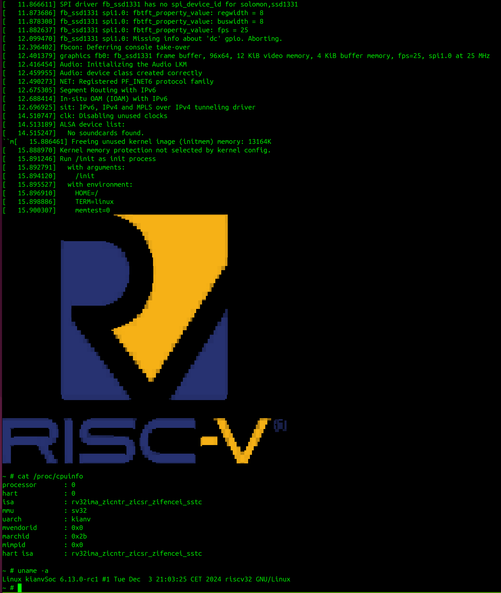

KianV RV32IMA SV32 zicntr ULX3S Linux SoC Demo
==============================================

I'm offering demo images for the UL3XS FPGA with an 12F, 25F, 45F and 85F variant, designed
to operate at 55MHz, 65MHz and 70MHz. These are just
demos, but there's room for optimization to extract a few more clock cycles.
The images come with the latest kernel version 6.6.8 and support for the
following PMODs (refer to the photo): GPIO (input, output), Network PMOD
(Digilent PMOD NIC100), second UART (PMOD UART by Digilent), and an OLED
display (Digilent OLEDrgb 64x96, 16-bit). The board can operate without these
PMODs, and the kernel will adjust accordingly.

If no PMODs are available, you can still enjoy music as a consolation. Simply
navigate to the /root/music directory and execute

```
cat *.wav > /dev/dsp to play
```
all files. This command can be sent to the background, allowing you to do other
tasks. There are a few demo programs, such as ./raytracer, available under
/root that you can explore.

GPIO manipulation is also possible by switching to the /sys/class/gpio
directory. It's worthwhile to enter su - after booting up, though I won't
reveal why here. The GPIOs start at 512, and we have 8 available. You can
access them using echo 512 > /sys/class/gpio/export and then modify their
attributes, setting them as input or output, or query/set their values using
the standard interface.

If you have an Ethernet PMOD, you can configure your IP address using ip or
ifconfig. Both IPv4 and IPv6 are supported. NFS support is also included,
allowing you to mount the filesystem over the network. This will require the
toolchain, which is forthcoming, to compile and run your own programs on the
SoC.

A swap filesystem is also viable through mkswap, swapon, and swapoff commands.
While not necessarily practical, it's robust and worth experimenting with to
see what binaries are available.

For the 2x UARTs connections, use
```
tio -m INLCRNL -o 1 /dev/ttyUSBx -b 3000000
```
I plan to implement support for lower rates. If a network is available, you can start the
telnet daemon, etc., as shown in /etc/init.d/rcS.

```
# cat /etc/init.d/rcS
#! /bin/sh

#mount -t devtmpfs devtmpfs /dev
mkdir -p /dev/pts /dev/shm
mount -a
hostname $(cat /etc/hostname)
export TZ=CET-1CEST,M3.5.0,M10.5.0/3
#ifconfig eth0 192.168.2.89
#route add default gw 192.168.2.1
#echo "nameserver 192.168.2.1" > /etc/resolv.conf
#ntpd -g
#telnetd
```


The SoC isn't fully complete yet but is stable. I aim to optimize a few more
clock cycles without going overboard. Technically, we have an
RV32IMA SV32 zicntr multicyle CPU, 3 SPI devices, 1 audio device, 1 GPIO controller, 1 SPI NOR
controller, video framebuffer, an audio device, 2 TLBs (one for data and one for instructions), a
2-way associative ICache, and an SDRAM controller. The setup is kept simple to
gain knowledge for future projects, where I plan to apply advanced concepts for
the next Linux SoCs, such as pipelining, larger cache block sizes, DDR RAM with
burst, etc., with the goal of running Debian and GCC on Debian.

Installation SD Card:
---------------------
Please use very good SD cards. I'm overclocking the SPI bus to 35MHz.
```
zcat sv32_kianv_sd_x.img.gz | dd of=/dev/sdaX status=progress
```
FPGA Bitstream:
---------------
```
openFPGALoader -f --board=ulx3s soc_x.bit Bootloader:
```
bootloader:
-----------
```
ftdiflash -o 1048576 bootloader.bin
```

In this photo, you can see the ULX3S along with all the PMODs that are
supported both on the hardware and kernel side. It's also possible to operate
the SoC without these PMODs using the same image, though it might be less fun.
However, listening to audio and experimenting is still enjoyable.



best,

Hirosh
