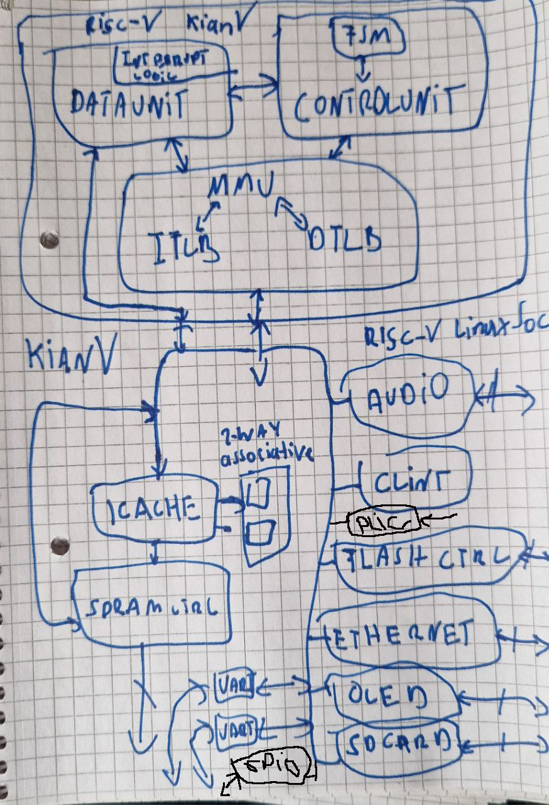
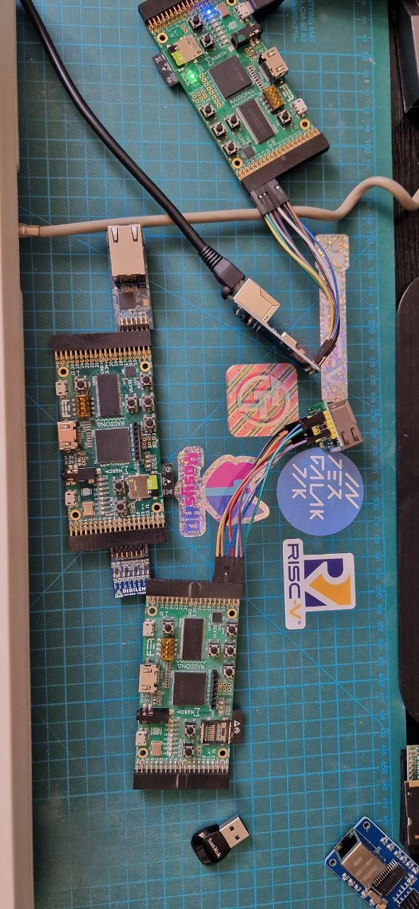

KianV RV32IMA SV32 zicntr Linux SoC
====================================

It's just a proof of concept project so that I can understand how to implement a Linux SoC.
I implemented it as primitively as possible to achieve the goal. Actually,
it took less than two weeks before we could boot real Linux on the FPGA. That was during the Christmas holidays,
and it was a good opportunity to play around with it.

The SoC is operating with the most recent kernel version, v6.9.3,
and offers support for the following PMODs (as shown in the photo): GPIO (input, output),
Network PMOD (Digilent PMOD NIC100), a second UART (PMOD UART by Digilent), and an OLED display (Digilent OLEDrgb 64x96, 16-bit).
The board is capable of functioning without these PMODs, with the kernel adjusting accordingly.

If no PMODs are available, you can still enjoy music as a consolation (only enterprise soc). Simply
navigate to the /root/music directory and execute

```
cat *.wav > /dev/dsp to play
```
all files. This command can be sent to the background, allowing you to do other
tasks. There are a few demo programs, such as ./raytracer, available under
/root that you can explore.

I have also precompiled the source of [TinyProgram](https://github.com/BrunoLevy/TinyPrograms) (/root/TinyPrograms)
and it can be executed.

GPIO manipulation is also possible by switching to the /sys/class/gpio
directory. It's worthwhile to enter su - after booting up, though I won't
reveal why here. The GPIOs start at 512, and we have 8 available. You can
access them using echo 512 > /sys/class/gpio/export and then modify their
attributes, setting them as input or output, or query/set their values using
the standard interface.

If you have an Ethernet PMOD, you can configure your IP address using ip or
ifconfig. Both IPv4 and IPv6 are supported. NFS support is also included,
allowing you to mount the filesystem over the network. This will require the
toolchain, which is forthcoming, to compile and run your own programs on the
SoC.
I also have an Ethernet PMOD in progress; when I receive it from JLCPCB,
I will share the PCB PMOD as well.

A swap filesystem is also viable through mkswap, swapon, and swapoff commands.
While not necessarily practical, it's robust and worth experimenting with to
see what binaries are available.

For the 2x UARTs connections, use
```
tio -m INLCRNL -o 1 /dev/ttyUSBx -b 15000000
```
If a network is available, you can start the
telnet daemon, etc., as shown in /etc/init.d/rcS.

```
# cat /etc/init.d/rcS
#! /bin/sh

#mount -t devtmpfs devtmpfs /dev
mkdir -p /dev/pts /dev/shm
mount -a
hostname $(cat /etc/hostname)
export TZ=CET-1CEST,M3.5.0,M10.5.0/3
#ifconfig eth0 192.168.2.89
#route add default gw 192.168.2.1
#echo "nameserver 192.168.2.1" > /etc/resolv.conf
#ntpd -g
#telnetd
```

Technically, we have an
RV32IMA SV32 zicntr multicyle CPU, 3 SPI devices, 1 audio device, 1 GPIO controller, 1 SPI NOR
controller, video framebuffer, an audio device, 2 TLBs (one for data and one for instructions), a
2-way associative ICache, and an SDRAM controller. The setup is kept simple to
gain knowledge for future projects, where I plan to apply advanced concepts for
the next Linux SoCs, such as pipelining, larger cache block sizes, DDR RAM with
burst, etc., with the goal of running Debian and GCC on Debian.

Network Chip support
====================
We support [ENC28J60 (default), ENC24J600, W5500] network chips. You can
purchase such boards for a few dollars. You need to connect them via CS, SCLK,
MOSI, MISO, and interrupt pins. Additionally, some boards have a reset
pin; just connect it to VCC. Check the ULX3S configuration: CS <->
GN17, MOSI <-> GN16, MISO <-> GN15, SCLK <-> GN14, and INTERRUPT <-> GP17.
```
# make NETWORK_CHIP=[enc28j60 (default), encx24j600, w5500]
```

Generating gateware
---------------------
Currently, two FPGA boards are supported: the ULX3S (12k, 85k, 25k, 12k, um-85k) and the IceSugarPro. They are built as follows:
```
cd engineerig
./build_ulx3s.sh [12k, 85k, 25k, 12k, um-85k] # default is 85k
```
or

```
cd engineerig
./build_icesugar.sh
```
IceSugar takes the soc_minimal.v but can also be expanded to the enterprise version. The IOs must be mapped accordingly in the LPF file.
The clock rates are included in the Makefile and can be changed; multiple synthesis runs are needed.
70 MHz should also be feasible, but I have kept it conservative. It's about 8 times faster than a VAX.


Installation Demo Image for SD Card:
-----------------------------------
Please use very good SD cards. I'm overclocking the SPI bus to 35MHz.
```
zcat kianv_sv32_full_os_sd.img.gz | dd of=/dev/sdaX status=progress
```
FPGA Bitstream:
---------------
```
openFPGALoader -f --board=ulx3s soc_x.bit  # ulx3s
icesprog soc.bit # icesugarpro
```

Build operating system everything from scratch
-----------------------------------------------
```
cd buildroot-kianv-soc
# make NETWORK_CHIP=[enc28j60 (default), encx24j600, w5500]
make -j $(nproc) # build full operating system
make flash_os DEVICE=/dev/sdx # flash full operating system
#make flash_rootfs DEVICE=/dev/sdx # flash only rootfs
#make flash_kernel DEVICE=/dev/sdx # flash kernel
```

In this photo, you can see the ULX3S along with all the PMODs that are
supported both on the hardware and kernel side. It's also possible to operate
the SoC without these PMODs using the same image, though it might be less fun.
However, listening to audio and experimenting is still enjoyable.





best,
Hirosh

Resources I have used:

- https://github.com/smunaut/iCE40linux
- https://github.com/splinedrive/iCE40linux
- https://www.five-embeddev.com/riscv-isa-manual/latest/machine.html
- https://courses.cs.duke.edu/fall22/compsci510/schedule.html
- https://github.com/jameslzhu/riscv-card
- https://danielmangum.com/posts/risc-v-bytes-qemu-gdb/
- https://www.qemu.org/docs/master/system/target-riscv.html
- https://riscv.org/technical/specifications/
- https://starfivetech.com/uploads/sifive-interrupt-cookbook-v1p2.pdf 
- https://github.com/ultraembedded/exactstep
  (It was very educational, and I was able to compare it with the specification directly.)
- https://github.com/qemu
- https://github.com/pulp-platform/clint
- https://gitlab.com/x653/xv6-riscv-fpga
- https://github.com/regymm/quasiSoC
- https://pdos.csail.mit.edu/6.S081/2020/xv6/book-riscv-rev1.pdf
- https://github.com/cnlohr/mini-rv32ima

and many more!
